# Домашнее задание к занятию 11 «Teamcity»

## Подготовка к выполнению

1. В Yandex Cloud создайте новый инстанс (4CPU4RAM) на основе образа `jetbrains/teamcity-server`.
2. Дождитесь запуска teamcity, выполните первоначальную настройку.
3. Создайте ещё один инстанс (2CPU4RAM) на основе образа `jetbrains/teamcity-agent`. Пропишите к нему переменную окружения `SERVER_URL: "http://<teamcity_url>:8111"`.
4. Авторизуйте агент.
5. Сделайте fork [репозитория](https://github.com/aragastmatb/example-teamcity).
6. Создайте VM (2CPU4RAM) и запустите [playbook](./infrastructure).

## Основная часть

1. Создайте новый проект в teamcity на основе fork.
2. Сделайте autodetect конфигурации.
3. Сохраните необходимые шаги, запустите первую сборку master.
4. Поменяйте условия сборки: если сборка по ветке `master`, то должен происходит `mvn clean deploy`, иначе `mvn clean test`.
5. Для deploy будет необходимо загрузить [settings.xml](./teamcity/settings.xml) в набор конфигураций maven у teamcity, предварительно записав туда креды для подключения к nexus.
6. В pom.xml необходимо поменять ссылки на репозиторий и nexus.
7. Запустите сборку по master, убедитесь, что всё прошло успешно и артефакт появился в nexus.
8. Мигрируйте `build configuration` в репозиторий.
9. Создайте отдельную ветку `feature/add_reply` в репозитории.
10. Напишите новый метод для класса Welcomer: метод должен возвращать произвольную реплику, содержащую слово `hunter`.
11. Дополните тест для нового метода на поиск слова `hunter` в новой реплике.
12. Сделайте push всех изменений в новую ветку репозитория.
13. Убедитесь, что сборка самостоятельно запустилась, тесты прошли успешно.
14. Внесите изменения из произвольной ветки `feature/add_reply` в `master` через `Merge`.
15. Убедитесь, что нет собранного артефакта в сборке по ветке `master`.
16. Настройте конфигурацию так, чтобы она собирала `.jar` в артефакты сборки.
17. Проведите повторную сборку мастера, убедитесь, что сбора прошла успешно и артефакты собраны.
18. Проверьте, что конфигурация в репозитории содержит все настройки конфигурации из teamcity.
19. В ответе пришлите ссылку на репозиторий.

## Решение

:white_check_mark: В Yandex Cloud создан новый инстанс


**Container Solution:** jetbrains/teamcity-server\
**Name:** teamcity-server\
**CPU:** 4\
**RAM:** 4\
**HDD:** 20

:white_check_mark: Выполнена первоначальная настройка **Teamcity**

:white_check_mark: Создан ещё один инстанс

**Container Solution:** jetbrains/teamcity-agent\
**Name:** teamcity-agent\
**CPU:** 2\
**RAM:** 4\
**HDD:** 20

Прописана переменная окружения

|**ключ**|**значение**|
|:--|:--|
|SERVER_URL|http://<teamcity_server_url>:8111|

:white_check_mark: Авторизован агент

:white_check_mark: Создан fork [репозитория](https://github.com/aragastmatb/example-teamcity)

:white_check_mark: Создана **VM**

**Marketplace:** CentOS 7\
**Name:** nexus\
**CPU:** 2\
**RAM:** 4\
**HDD:** 20

:white_check_mark: Запущен [playbook](https://github.com/netology-code/mnt-homeworks/blob/MNT-video/09-ci-05-teamcity/infrastructure) на **VM**

:white_check_mark: 1. Создан новый проект в **Teamcity** на основе fork'a

Создать новый проект (DZ)

**Create** → **New building configuration** → **Connect new repository** → **Any Git URL** → (Name: JavaHat)

:white_check_mark: 2. Сделан autodetect конфигурации

:white_check_mark: 3. Сохранены необходимые шаги, запущена первая сборка `master`

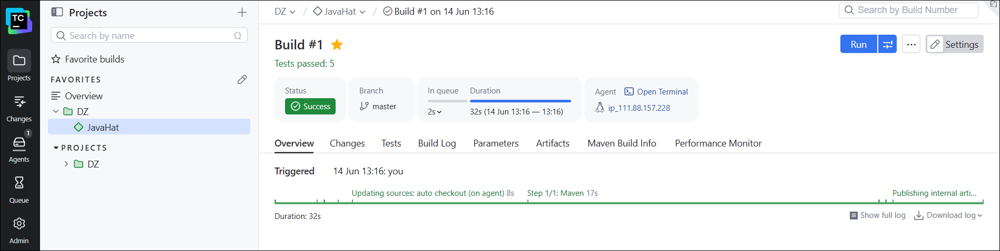

:white_check_mark: 4. Изменены условия сборки

```
    если сборка по ветке master, то 
        должен происходить mvn clean deploy,
    иначе mvn clean test.
```

a. В Building configuration: **Settings** → **Build steps** → Для первого существующего шага **Edit**

**Step name:** Deploy (master)\
**Execute step:** add condition → Other condition

&nbsp;&nbsp;&nbsp;&nbsp;&nbsp;&nbsp;&nbsp;&nbsp;**Parameter Name:** teamcity.build.branch\
&nbsp;&nbsp;&nbsp;&nbsp;&nbsp;&nbsp;&nbsp;&nbsp;**Condition:** equals\
&nbsp;&nbsp;&nbsp;&nbsp;&nbsp;&nbsp;&nbsp;&nbsp;**Value:** master

**Goals:** clean deploy\
**Path to POM file:** pom.xml

b. В Building configuration: **Settings** → **Build steps** → **Add build step** → **Maven**

**Step name:** Tests (other branches)\
**Execute step:** add condition → Other condition

&nbsp;&nbsp;&nbsp;&nbsp;&nbsp;&nbsp;&nbsp;&nbsp;**Parameter Name:** teamcity.build.branch\
&nbsp;&nbsp;&nbsp;&nbsp;&nbsp;&nbsp;&nbsp;&nbsp;**Condition:** does not equals\
&nbsp;&nbsp;&nbsp;&nbsp;&nbsp;&nbsp;&nbsp;&nbsp;**Value:** master

**Goals:** clean test\
**Path to POM file:** pom.xml

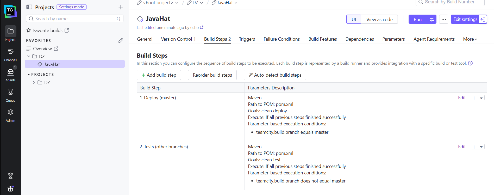

:white_check_mark: 5. Для deploy загружен settings.xml в набор конфигураций maven у **Teamcity**, предварительно записав параметры для подключения к nexus.

*\*nexus_directory_data: "/home/{{ nexus_user_name }}/sonatype-work/nexus3"*

В директории форка создан новый файл:

*settings.xml*
```xml
<settings xmlns="http://maven.apache.org/SETTINGS/1.2.0"
          xmlns:xsi="http://www.w3.org/2001/XMLSchema-instance"
          xsi:schemaLocation="http://maven.apache.org/SETTINGS/1.2.0 http://maven.apache.org/xsd/settings-1.2.0.xsd">
  <servers>
    <server>
      <id>nexus</id>
      <username>admin</username>
      <password>admin123</password>
    </server>
    <server>
      <id>nexus-snapshots</id>
      <username>admin</username>
      <password>admin123</password>
    </server>
  </servers>
</settings>
```

:white_check_mark: 6. В *pom.xml* изменена ссылка на репозиторий и **nexus**

*pom.xml*

```xml
<?xml version="1.0" encoding="UTF-8"?>
<project xmlns="http://maven.apache.org/POM/4.0.0" xmlns:xsi="http://www.w3.org/2001/XMLSchema-instance"
        xsi:schemaLocation="http://maven.apache.org/POM/4.0.0 https://maven.apache.org/xsd/maven-4.0.0.xsd">
        <modelVersion>4.0.0</modelVersion>

        <groupId>org.netology</groupId>
        <artifactId>plaindoll</artifactId>
        <packaging>jar</packaging>
        <version>1.0.2</version>

        <properties>
                <maven.compiler.source>1.8</maven.compiler.source>
                <maven.compiler.target>1.8</maven.compiler.target>
        </properties>
        <distributionManagement>
                <repository>
                                <id>nexus</id>
                                <url>http://<IP_nexus>/repository/maven-releases</url>
                </repository>
        </distributionManagement>
        <dependencies>
                <dependency>
                        <groupId>junit</groupId>
                        <artifactId>junit</artifactId>
                        <version>4.12</version>
                        <scope>test</scope>
                </dependency>
        </dependencies>

        <build>
                <plugins>
                        <plugin>
                                <groupId>org.apache.maven.plugins</groupId>
                                <artifactId>maven-shade-plugin</artifactId>
                                <version>3.2.4</version>
                                <executions>
                                        <execution>
                                                <phase>package</phase>
                                                <goals>
                                                        <goal>shade</goal>
                                                </goals>
                                                <configuration>
                                                        <transformers>
                                                                <transformer implementation="org.apache.maven.plugins.shade.resource.ManifestResourceTransformer">
                                                                        <mainClass>plaindoll.HelloPlayer</mainClass>
                                                                </transformer>
                                                        </transformers>
                                                </configuration>
                                        </execution>
                                </executions>
                        </plugin>
                </plugins>
        </build>

</project>
```

Push в GitHub

Жму на название проекта (DZ) → **Maven Settings** → **Upload settings file** 

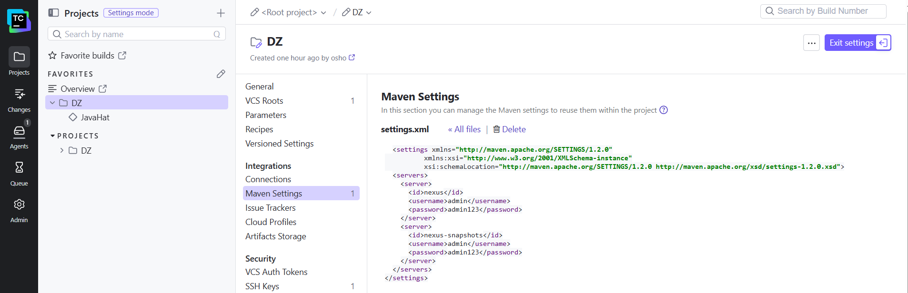

В проекте **Build Configuration** → **Build Steps** → В обоих шагах сборки **User settings selection** → settings.xml

:white_check_mark: 7. Запущена сборка на ветке master - всё прошло успешно и артефакт появился в **nexus**.

Ключевой момент в логах:
```
...
13:59:44   [INFO] --- deploy:3.1.2:deploy (default-deploy) @ plaindoll ---
13:59:44   [INFO] Uploading to nexus: http://111.88.156.40:8081/repository/maven-releases/org/netology/plaindoll/1.0.2/plaindoll-1.0.2.pom
13:59:45   [INFO] Uploaded to nexus: http://111.88.156.40:8081/repository/maven-releases/org/netology/plaindoll/1.0.2/plaindoll-1.0.2.pom (1.5 kB at 4.6 kB/s)
13:59:45   [INFO] Uploading to nexus: http://111.88.156.40:8081/repository/maven-releases/org/netology/plaindoll/1.0.2/plaindoll-1.0.2.jar
13:59:45   [INFO] Uploaded to nexus: http://111.88.156.40:8081/repository/maven-releases/org/netology/plaindoll/1.0.2/plaindoll-1.0.2.jar (3.1 kB at 21 kB/s)
13:59:45   [INFO] Downloading from nexus: http://111.88.156.40:8081/repository/maven-releases/org/netology/plaindoll/maven-metadata.xml
13:59:45   [INFO] Uploading to nexus: http://111.88.156.40:8081/repository/maven-releases/org/netology/plaindoll/maven-metadata.xml
13:59:45   [INFO] Uploaded to nexus: http://111.88.156.40:8081/repository/maven-releases/org/netology/plaindoll/maven-metadata.xml (301 B at 3.2 kB/s)
13:59:45   [INFO] ------------------------------------------------------------------------
13:59:45   [INFO] BUILD SUCCESS
13:59:45   [INFO] ------------------------------------------------------------------------
...
13:59:45 Step 2/2: Tests (other branches) (Maven)
13:59:45   Build step Tests (other branches) (Maven) is skipped because of unfulfilled condition: "teamcity.build.branch does not equal master"
13:59:46 Publishing artifacts
13:59:46 Publishing internal artifacts
13:59:46 Publishing internal artifacts
13:59:46 Build finished
```

Особенность такого подхода: в Step 1/2: Deploy (master) (Maven) всё-равно запускаются тесты
```
...
13:59:38   [INFO] -------------------------------------------------------
13:59:38   [INFO]  T E S T S
13:59:38   [INFO] -------------------------------------------------------
13:59:39   [INFO] Running plaindoll.WelcomerTest
13:59:39   [INFO] Tests run: 5, Failures: 0, Errors: 0, Skipped: 0, Time elapsed: 0.065 s -- in plaindoll.WelcomerTest
13:59:39   [INFO]
13:59:39   [INFO] Results:
13:59:39   [INFO]
13:59:39   [INFO] Tests run: 5, Failures: 0, Errors: 0, Skipped: 0
...
```

Перестроение архитектуры:

a. В Building configuration: **Settings** → **Build steps** → **Add build step** → **Maven**

**Step name:** Tests (other branches)\
**Execute step:** add condition → Other condition

&nbsp;&nbsp;&nbsp;&nbsp;&nbsp;&nbsp;&nbsp;&nbsp;**Parameter Name:** teamcity.build.branch\
&nbsp;&nbsp;&nbsp;&nbsp;&nbsp;&nbsp;&nbsp;&nbsp;**Condition:** does not equals\
&nbsp;&nbsp;&nbsp;&nbsp;&nbsp;&nbsp;&nbsp;&nbsp;**Value:** master

**Goals:** clean test\
**Path to POM file:** pom.xml

b. В Building configuration: **Settings** → **Build steps** → Для первого существующего шага **Edit**

**Step name:** Deploy (master)\
**Execute step:** add condition → Other condition

&nbsp;&nbsp;&nbsp;&nbsp;&nbsp;&nbsp;&nbsp;&nbsp;**Parameter Name:** teamcity.build.branch\
&nbsp;&nbsp;&nbsp;&nbsp;&nbsp;&nbsp;&nbsp;&nbsp;**Condition:** equals\
&nbsp;&nbsp;&nbsp;&nbsp;&nbsp;&nbsp;&nbsp;&nbsp;**Value:** master

**Goals:** deploy -DskipTests\
**Path to POM file:** pom.xml

*\* Удалена команда clean, чтобы остались результаты тестов*\
*\* Добавлен флаг -DskipTests для пропуска тестов*

Для проверки создана новая версия:

*pom.xml*
```xml
        <groupId>org.netology</groupId>
        <artifactId>plaindoll</artifactId>
        <packaging>jar</packaging>
        <version>2.0.2</version>
```

Результат:

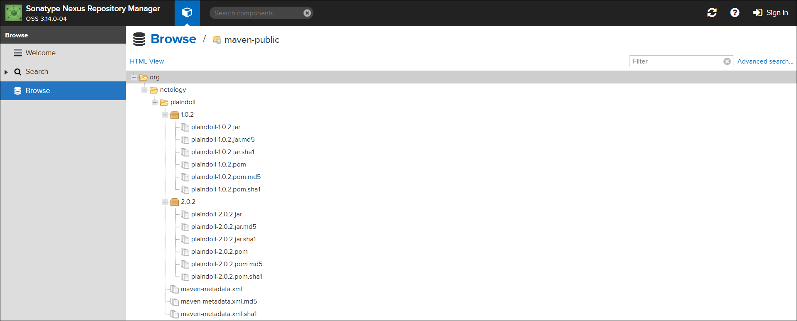

:white_check_mark: 8. Вкладка build configuration

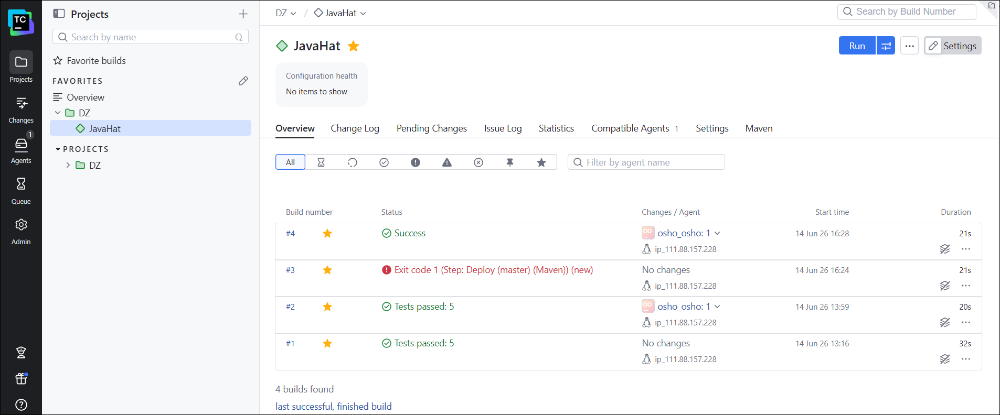

:white_check_mark: 9. Создана отдельная ветка feature/add_reply

:white_check_mark: 10. Написан новый метод для класса Welcomer:

*Welcomer.java*
```java
package plaindoll;

public class Welcomer{
        public String sayWelcome() {
                return "Welcome home, good hunter. What is it your desire?";
        }
        public String sayFarewell() {
                return "Farewell, good hunter. May you find your worth in waking world.";
        }
        public String sayNeedGold(){
                return "Not enough gold";
        }
        public String saySome(){
                return "something in the way";
        }
        public String sayHunterReply() {
                return "hunter";
        }
}
```

:white_check_mark: 11. Дополнен тест для нового метода на поиск слова hunter в новой реплике

*WelcomerTest.java*
```java
package plaindoll;

import static org.hamcrest.CoreMatchers.containsString;
import static org.junit.Assert.*;

import org.junit.Test;

public class WelcomerTest {

        private Welcomer welcomer = new Welcomer();

        @Test
        public void welcomerSaysWelcome() {
                assertThat(welcomer.sayWelcome(), containsString("Welcome"));
        }
        @Test
        public void welcomerSaysFarewell() {
                assertThat(welcomer.sayFarewell(), containsString("Farewell"));
        }
        @Test
        public void welcomerSaysHunter() {
                assertThat(welcomer.sayWelcome(), containsString("hunter"));
                assertThat(welcomer.sayFarewell(), containsString("hunter"));
        }
        @Test
        public void welcomerSaysSilver(){
                assertThat(welcomer.sayNeedGold(), containsString("gold"));
        }
        @Test
        public void welcomerSaysSomething(){
                assertThat(welcomer.saySome(), containsString("something"));
        }
        @Test
        public void welcomerSaysNewHunterReply() {
                assertThat(welcomer.sayHunterReply(), containsString("hunter"));
        }
}
```

:white_check_mark: 12. Сделан `push` всех изменений в новую ветку репозитория

:white_check_mark: 13. Для самостоятельнй сборки пришлось изменить настройки

В папке проекта → **Settings** → **VCS Roots** → **Edit**

&nbsp;&nbsp;&nbsp;&nbsp;&nbsp;&nbsp;&nbsp;&nbsp;**Branch specification:** +:refs/heads/*

**Build configuration** →  **Settings** → **Trigger** → **Add new trigger** → **VCS Trigger**

&nbsp;&nbsp;&nbsp;&nbsp;&nbsp;&nbsp;&nbsp;&nbsp;**Branch filter:** +:*

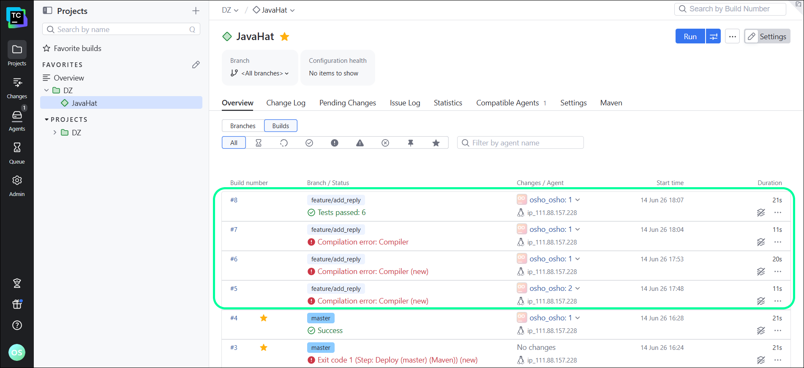

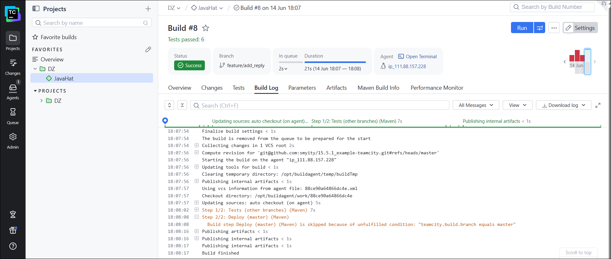

Теперь лог тестов:
```
...
18:08:07   [INFO] -------------------------------------------------------
18:08:07   [INFO]  T E S T S
18:08:07   [INFO] -------------------------------------------------------
18:08:08   [INFO] Running plaindoll.WelcomerTest
18:08:08   [INFO] Tests run: 6, Failures: 0, Errors: 0, Skipped: 0, Time elapsed: 0.065 s -- in plaindoll.WelcomerTest
18:08:08   [INFO]
18:08:08   [INFO] Results:
18:08:08   [INFO]
18:08:08   [INFO] Tests run: 6, Failures: 0, Errors: 0, Skipped: 0
...
```

:white_check_mark: 14. Внесены изменения из ветки `feature/add_reply` в `master` через **`merge`**.

Изменена версия

**pom.xml**
```xml
...
        <groupId>org.netology</groupId>
        <artifactId>plaindoll</artifactId>
        <packaging>jar</packaging>
        <version>3.0.2</version>
...
```

```
git switch master
```
```
git merge feature/add_reply
```

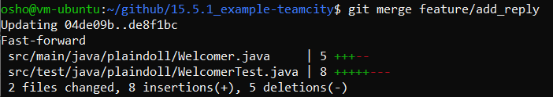

:white_check_mark: 16. Настроена конфигурация так, чтобы она собирала .jar в артефакты сборки

**Build configuration** →  **Settings** → **General**

&nbsp;&nbsp;&nbsp;&nbsp;&nbsp;&nbsp;&nbsp;&nbsp;**Artifact paths:** target/*.jar

:white_check_mark: 17. Проведите повторную сборку мастера, убедитесь, что сборка прошла успешно и артефакты собраны.

```
git push origin master
```

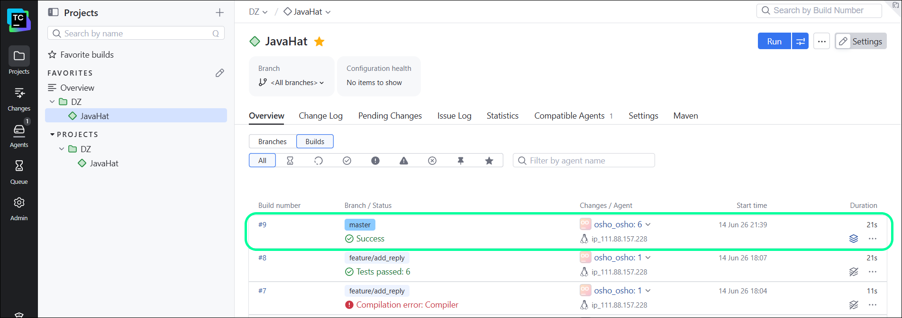

:white_check_mark: 18. Конфигурация в репозитории содержит все настройки конфигурации из **Teamcity**

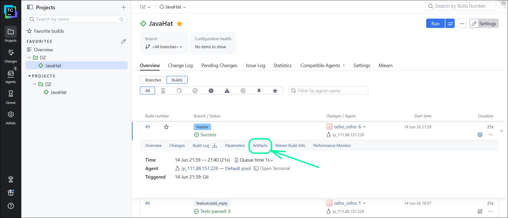

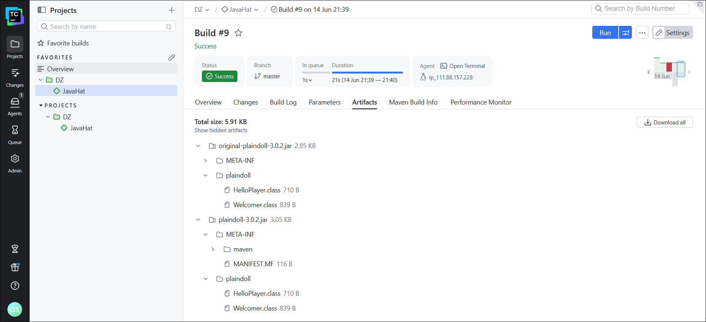

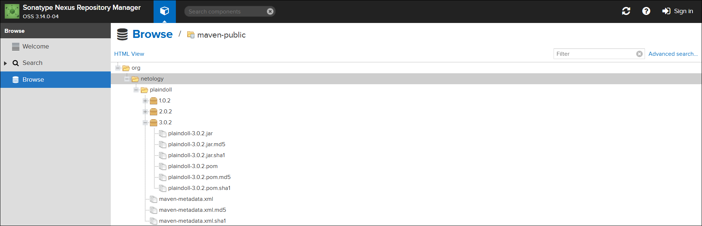

В предыдущем шаге артефактов не было:

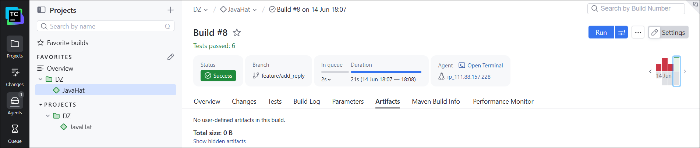